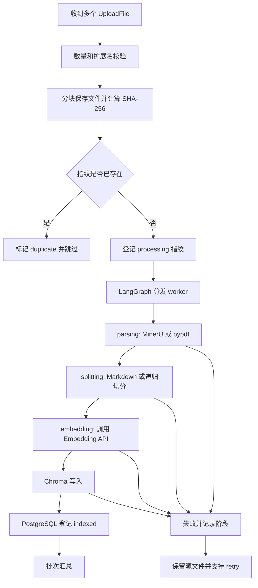

# 批量上传工程闭环与优化思路

本项目的批量上传不是把多个文件简单地放进一个 `for` 循环，而是把一次批量请求拆成多个可以观察、统计和恢复的文件任务。

## 处理流程



当前接口仍然是同步返回：调用方等待这一批文件处理结束后得到最终结果。PostgreSQL 会保存完整过程，因此即使只看到最终响应，也能在批次历史中知道每个文件成功、失败、跳过以及失败在哪个阶段。

## 状态设计

批次状态：

```text
running -> completed
        -> partial_success
        -> failed
```

文件状态：

```text
queued -> saving -> parsing -> splitting -> embedding -> indexed
                                                       \-> failed
queued -----------------------------------------------> duplicate
```

`partial_success` 表示同一批中至少有一个文件成功、至少有一个文件失败。`duplicate` 不算成功或失败，而是计入 `skipped`，因为它没有再次消耗 MinerU、Embedding 和 Chroma 写入成本。

## 为什么先做边界校验

上传入口是最便宜、最容易判断的阶段。项目默认限制每批 10 个文件、单文件 50 MB，并且按 1 MB 分块读文件。

这样可以：

- 尽早拒绝不支持的扩展名和超大文件。
- 避免将整个 PDF 一次性读入 Python 内存。
- 在调用 MinerU 和 Embedding 之前发现问题，减少外部 API 消耗。

限制可以在 `.env` 中调整：

```env
MAX_BATCH_FILES=10
MAX_UPLOAD_FILE_SIZE_MB=50
UPLOAD_READ_CHUNK_SIZE=1048576
UPLOAD_CONCURRENCY=2
MAX_UPLOAD_RETRIES=3
```

## 为什么使用 SHA-256 去重

文件名不是可靠的唯一标识。下面两个文件名不同，但内容可能完全相同：

```text
制度说明.pdf
制度说明(1).pdf
```

项目在保存文件时计算内容 SHA-256，并在 `document_fingerprints` 表中原子登记。已有相同指纹时返回已有 `document_id`，并删除本次重复保存的临时文件。

这叫幂等处理：同一份内容重复执行，不会不断增加重复 chunk。

## 为什么需要阶段状态

“失败”这个词太粗。MinerU 解析失败、文本切分为空、Embedding 超时和 Chroma 写入失败，排查方向完全不同。

所以每个 item 都记录：

- 当前 `status`。
- `error_stage`，例如 `parsing`、`splitting`、`embedding`。
- 截断后的 `error` 信息。
- `duration_ms`。
- `retry_count`。

状态写入 PostgreSQL 后，前端、Swagger 和后续重试都可以使用同一份事实来源。

## 为什么一个文件失败不能影响整批

批量处理是多个独立文件任务的集合。某个 PDF 解析失败，不应让其他正常 Markdown 文件回滚。

LangGraph 的 Orchestrator-Worker 负责把每个文件分发给独立 worker。worker 捕获自己的异常并返回文件级错误，汇总节点只负责形成批次结果，因此可以得到：

```json
{
  "total": 3,
  "succeeded": 2,
  "failed": 1,
  "skipped": 0,
  "status": "partial_success"
}
```

## 为什么需要补偿清理

PostgreSQL 和 Chroma 是两个独立存储，它们不能共享一个数据库事务。可能出现这种中间状态：

1. Chroma 已经写入 chunk。
2. PostgreSQL 登记文档时发生异常。

如果直接返回失败，向量库里会留下没有文档记录的孤儿向量。项目在异常路径中使用 `document_id` 调用 Chroma 删除，尽量把两个存储恢复到一致状态。

这是补偿事务思路：不能保证跨系统原子提交，就在失败时执行反向操作。

## 为什么限制并发和使用线程

MinerU 客户端和 Embedding 调用使用同步 HTTP/SDK。直接在 FastAPI 协程里执行会阻塞事件循环，使其他请求无法及时响应。

项目让 worker 使用 `asyncio.to_thread` 执行阻塞入库流程，并用 semaphore 限制同时处理的文件数量为 2。Chroma 本地写入还使用进程内锁，避免并发 upsert 和失败回滚相互干扰。

这里的并发限制不是越大越好：外部 API 有速率限制，本地机器也有内存和磁盘压力。实际项目应根据 API 限额和压测结果调整。

## 重试规则

只有 `failed` 文件可以重试，成功和重复文件不会重新处理。重试：

1. 复用 PostgreSQL 中保存的源文件路径。
2. 清除上一次可能留下的同文档向量。
3. 重新登记指纹为 `processing`。
4. 从 `parsing` 阶段重新执行。
5. 成功后更新原 item 为 `indexed`。

默认最多重试 3 次。源文件被删除或达到重试上限时，接口会明确返回错误。

## API

批量上传：

```http
POST /api/documents/upload-batch
```

查询最近批次：

```http
GET /api/documents/upload-batches?limit=20
```

查询批次明细：

```http
GET /api/documents/upload-batches/{batch_id}
```

重试某个失败文件：

```http
POST /api/documents/upload-batches/{batch_id}/items/{item_id}/retry
```

批次响应保留旧版的 `total`、`succeeded`、`failed`、`results`、`errors` 和 `graph_path`，同时增加 `batch_id`、`status`、`skipped`、`duration_ms` 和 `items`，因此旧客户端仍能读取原有字段。

## 面试和简历中的表达

可以这样解释这部分工作：

> 针对多文件知识库导入场景，设计基于 SHA-256 的幂等去重和文件级状态机，使用 LangGraph Orchestrator-Worker 隔离单文件失败；将 MinerU、切分、Embedding、Chroma 写入分阶段记录，并在跨 PostgreSQL/Chroma 写入失败时执行补偿删除，同时提供失败文件重试和批次历史查询。

重点不是声称系统已经是分布式生产平台，而是准确说明你解决了批量导入中的重复、部分失败、定位困难和脏数据问题。
